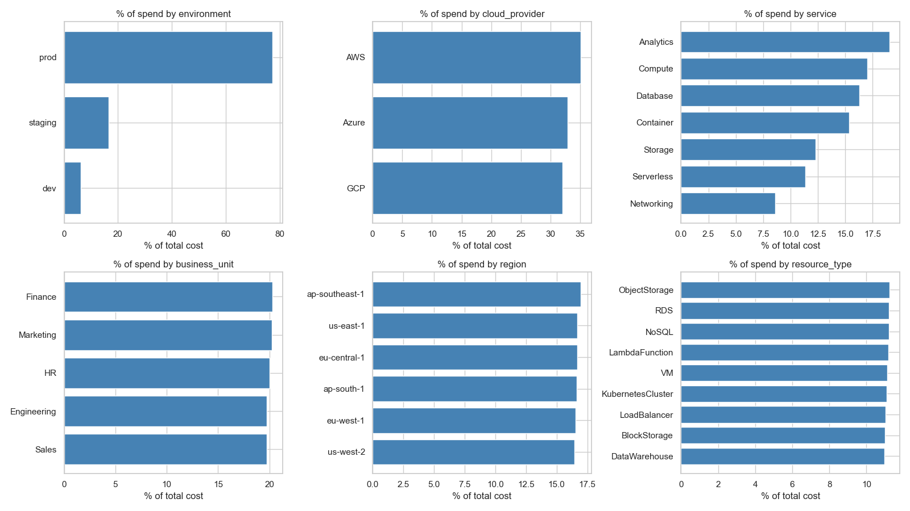
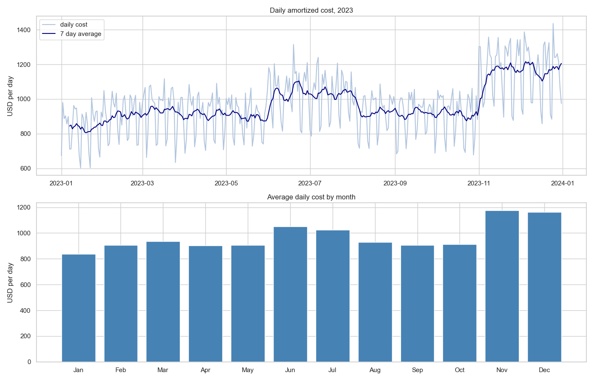
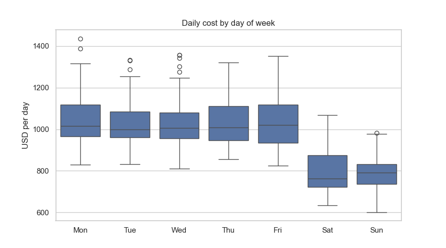
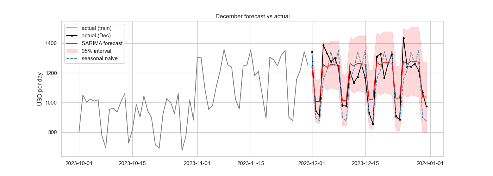

# Cloud Cost Optimization and Expected Spend Forecasting

**Author**

Gowdilyan Subramaniam

#### Executive summary

In this project I used one year (2023) of daily cloud billing data to see if past spend can be used to forecast the next month's cloud cost. The data was clean, and the EDA showed two main things: a strong weekly pattern (weekends are about 24% cheaper) and a few jumps in overall spend, the biggest one in November. As a baseline model I trained a SARIMA model on January to November and forecast December. It got a MAPE of 6.4%, which is better than both simple baselines I compared it with, and the December total was only 1.9% off from the actual.

#### Rationale

Cloud costs change every day and teams usually find out about overspending only after the monthly bill comes in. If engineering and finance had a forecast of the expected spend, they could plan budgets better and notice early when costs are going higher than expected.

#### Research Question

How can an organization use historical time series analysis to build an accurate forecasting model for its expected cloud infrastructure costs?

#### Data Sources

[Cloud Budget Dataset on Kaggle](https://www.kaggle.com/datasets/rasikaekanayakadevlk/cloud-budget-dataset). I used the main file `cloud_budget_2023_dataset.csv` (in the `data` folder). It has 54,750 rows and 40 columns, with 150 billing line items per day for all of 2023 across AWS, Azure and GCP. The target is `amortized_cost`, summed per day.

Changes since my Module 16 proposal:
- The proposal mentioned CPU, RAM and storage utilization as predictors, but the dataset doesn't have those columns. The only usage metric is `usage_quantity`.
- I expected daily and weekly cycles. The data is daily, so there's no within-day cycle, and only the weekly season turned out to matter.
- The budget and anomaly columns aren't useful (budget status is always "under" and there are no anomalies flagged), so I compare the forecast to actual spend instead of the budget.
- The dataset is synthetic.

#### Methodology

- Data cleaning: checked missing values, duplicates and missing days. Dropped columns with a single value and the `tags` column.
- Outliers: used the IQR rule on rows and on daily totals. The outliers were real prod costs and the high days were part of the November/December increase, so I kept them.
- Feature engineering: `is_weekend`, `savings_rate`, a 7 day lag and a 7 day rolling average.
- EDA: spend by category, distributions, usage vs cost, correlation heatmap, cost over time and the weekly pattern.
- Time series checks: MSTL decomposition (weekly and monthly), ADF test for stationarity and ACF/PACF plots.
- Baseline model: train on Jan to Nov, test on Dec. Compared a naive forecast, a seasonal naive forecast and SARIMA. I tried a few SARIMA orders and picked the one with the lowest AIC.

I used MAPE as the main metric because it's easy to explain as a percentage ("the forecast is off by about 6% a day") and it doesn't depend on the size of the budget. Daily cost is never close to zero (minimum is around $600), so MAPE works fine here. I also report MAE and RMSE in dollars.

#### Results

Prod makes up about 77% of the spend. Provider, region and business unit are split almost evenly.

Spend goes up slowly in the first half of the year, has a bump in June/July, and jumps about 29% in November.

Weekends are about 24% cheaper than weekdays ($796 vs $1,042 per day). This weekly pattern shows up in every environment.

December forecast results:

| Model | MAPE | MAE | RMSE |
|---|---|---|---|
| Naive | 13.9% | $141 | $188 |
| Seasonal naive | 7.3% | $87 | $112 |
| SARIMA(0,1,2)(0,1,1,7) | 6.4% | $71 | $84 |

SARIMA did the best on all three metrics. It forecast $36,721 for December against an actual $36,038 (1.9% off). Most of the gain over the naive forecast comes from picking up the weekly pattern.

#### Next steps

- Handle the jumps in spend better. A model trained only up to October would not see the November jump coming.
- Try other models like Holt-Winters, Prophet, or a regression model with lag and weekend features.
- Test on more than one month.
- Try forecasting prod, staging and dev separately.

#### Outline of project

- [EDA and baseline model notebook](https://github.com/gowdilyan/cloud_cost_optimization/blob/main/cloud_cost_eda.ipynb)

##### Contact and Further Information

GitHub: [gowdilyan](https://github.com/gowdilyan)
